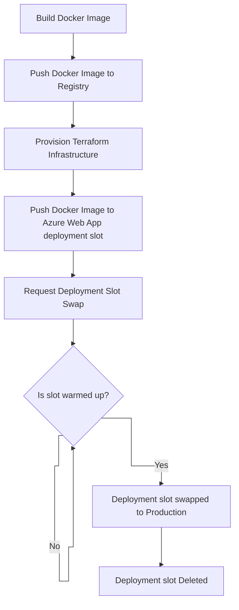

# Deployment Architecture

The build and release pipelines are all controlled via GitHub actions which act as our CI/CD process.

The actions are categorised into different types:

- **Validate**: Perform some sort of validation, such as running tests and are typically pass/fail
- **Generate**: Generate some sort of artifact, such as reporting
- **Deploy**: Perform a deployment to a target environment

## Build Pipeline

On creation of a Pull Request or push to main, multiple validation actions run, depending on what areas of the repo
have been modified. Any failures should be addressed before merging. Failures on main should be fixed as priority.

## Release Pipeline

The site is deployed via GitHub Actions.

Once the team is happy to publish a release, this can be done by running the "Deploy - Environment" action.

Publishing runs the following steps:

